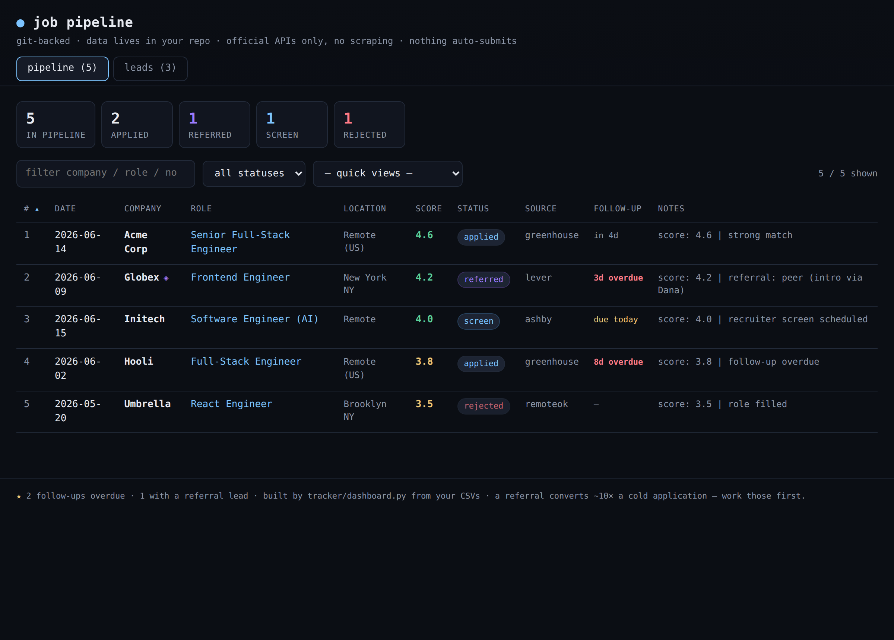

# job-search-toolkit

A small, dependency-free, ToS-respecting toolkit for running a job search that gets
*callbacks* — not a mass-apply bot. Every tool is **pure-Python standard library**: no
`pip install`, no Node, no build step, no account, no scraping. Clone it and run.

It does four things, in order of impact:

1. **Tailor** your resume to a posting — ethically (`tools/tailor.py`)
2. **Aggregate** fresh postings from official ATS APIs (`tools/aggregate.py`)
3. **Export** a clean, ATS-readable PDF from a Markdown resume (`tools/md_to_pdf.py`)
4. **Track** the whole pipeline in a self-contained HTML dashboard (`tracker/dashboard.py`)



<sub>The dashboard above is generated from the fictional sample data in `tracker/` — run `python3 tracker/dashboard.py --leads --serve` to see it.</sub>

> Why "no scraping"? LinkedIn / Indeed / Workday prohibit it in their ToS and shadow-filter
> bots anyway. Every source here is a company's own public job-board API. The whole toolkit
> is built on the premise that the bottleneck in a job search is **resume credibility +
> referrals**, not application volume.

---

## Prerequisites

- **Python 3.9 or newer** — the only hard requirement. Check with `python3 --version`.
- That's it. No `pip install`, no virtualenv, no Node, no build step — every tool imports
  only the Python standard library.
- **Optional:** an `ANTHROPIC_API_KEY` (from the [Anthropic Console](https://console.anthropic.com/))
  — needed *only* by `tools/tailor.py`. The other three tools never call an API.

## Clone & run

```bash
git clone https://github.com/<your-username>/job-search-toolkit.git
cd job-search-toolkit
python3 --version          # confirm 3.9+

# 1. Find fresh postings (official APIs only)
python3 tools/aggregate.py --keywords react node typescript --remote

# 2. Export your Markdown resume to an ATS-clean PDF
python3 tools/md_to_pdf.py examples/resume.md /tmp/resume.pdf

# 3. Tailor your resume to a specific posting (needs an Anthropic API key)
export ANTHROPIC_API_KEY=sk-ant-...
python3 tools/tailor.py examples/job_description.txt --resume examples/resume.md

# 4. Build the pipeline dashboard from the included sample data
python3 tracker/dashboard.py --leads --serve
```

Everything runs against the bundled fictional sample data out of the box, so you can try each
tool before adding anything of your own. When you're ready: replace `examples/resume.md` with
your real resume, edit the company slug lists at the top of `tools/aggregate.py` to target the
companies you care about, and start logging applications in `tracker/applications.csv`.

---

## The four tools

### `tools/tailor.py` — ethical ATS optimization
Scores how well your real resume matches a posting, surfaces the keywords the posting wants
that you *already* support (but don't emphasize), rewrites **your own** bullets to mirror the
posting's language, and lists honest gaps. **It will not invent experience** — when the
posting wants something your resume lacks, it flags it as a gap instead of fabricating it.
The only tool that calls an API (Anthropic); the static system prompt + resume are
prompt-cached so repeat runs are cheap.

### `tools/aggregate.py` — official-API job aggregator
Pulls postings from **Greenhouse, Lever, Ashby, Recruitee, SmartRecruiters, Workable**, and
RemoteOK — each a company's own public API or feed. Filters by keyword, location, remote, and
a seniority/title exclusion list; de-dupes by URL; optionally appends matches to a tracker
CSV. Add target companies by dropping their careers-URL slug into the lists at the top.

### `tools/md_to_pdf.py` — Markdown → ATS-clean PDF
Writes a valid PDF **by hand** (raw PDF objects + xref table, no library) using the base-14
Helvetica fonts so the text layer is fully selectable/extractable — `pdftotext out.pdf -`
returns clean keywords, which is exactly what an ATS parser does. Supports headings, bullets,
bold/italic, wrapping, and auto page breaks, and normalizes smart-quotes/em-dashes that
otherwise mangle ATS extraction.

### `tracker/dashboard.py` — self-contained pipeline dashboard
Reads your tracker CSVs and emits a single `dashboard.html` with the data inlined as JSON —
no server, no dependencies, no network. Status badges, a sortable/filterable table, a
follow-up-cadence highlighter (overdue rows turn red), per-row fit scores, and a referral
marker.

```bash
# Build the HTML (writes tracker/dashboard.html); --leads adds a Leads tab
python3 tracker/dashboard.py --leads

# ...or build AND open it on a local server that picks up CSV edits on refresh
python3 tracker/dashboard.py --leads --serve     # http://127.0.0.1:8765  (Ctrl-C to stop)
```

`dashboard.html` is fully standalone, so you can also just open the built file directly:

```bash
xdg-open tracker/dashboard.html        # Linux
open tracker/dashboard.html            # macOS
explorer.exe "$(wslpath -w tracker/dashboard.html)"   # Windows (WSL)
```

Once it's open, try: click the **score** or **follow-up** column headers to sort; use the
**quick views** dropdown (`follow-up due`, `has referral / intro`, `scored 4.0+`); and type in
the **filter** box to search company / role / notes. The generated `dashboard.html` is
gitignored — it's yours, rebuilt from your CSVs anytime.

---

## Playbooks (`playbooks/`)
The toolkit's opinion, in three short docs you apply by hand (no API calls):
- **`scoring_rubric.md`** — a 1–5 fit score + a ghost-job legitimacy tier, so you spend
  tailoring/referral effort on the right leads. Scores wire straight into the dashboard.
- **`outreach_templates.md`** — four referral-outreach archetypes (a referral converts ~10×
  a cold apply) under LinkedIn's 300-char cap.
- **`followup_playbook.md`** — what to actually send when the dashboard flags a row overdue,
  including a banned-phrase list and a stop-after-2 rule.

---

## The honest priority order
1. **Resume fixes** (title framing, gaps, typos) — biggest lever, free, today.
2. **Referrals / networking** per target company — biggest conversion multiplier.
3. **Tailoring** per application — beats ATS keyword filters.
4. **Volume** — last, and only once the above are working.

A resume that triggers rejections will trigger them *faster* if you automate. Fix, then scale.

## Requirements
Python 3.9+. That's it. `tools/tailor.py` additionally needs an `ANTHROPIC_API_KEY`.

## License
MIT — see [LICENSE](LICENSE).
